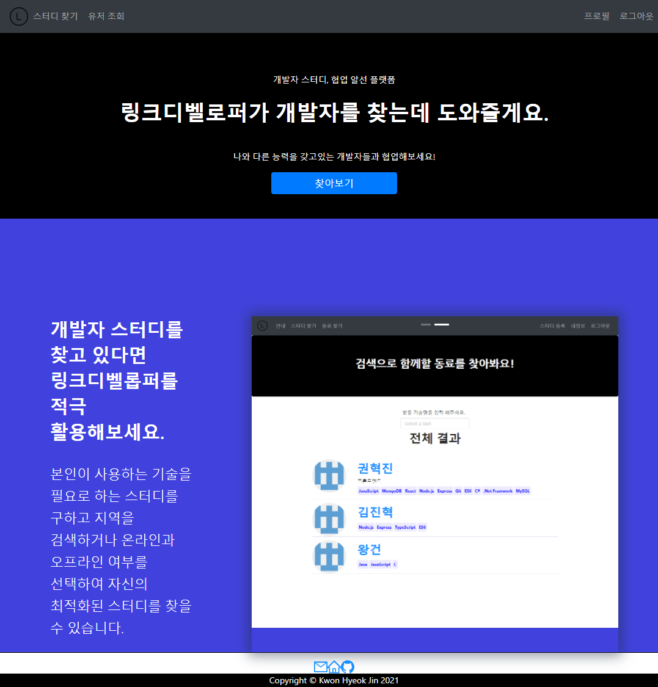
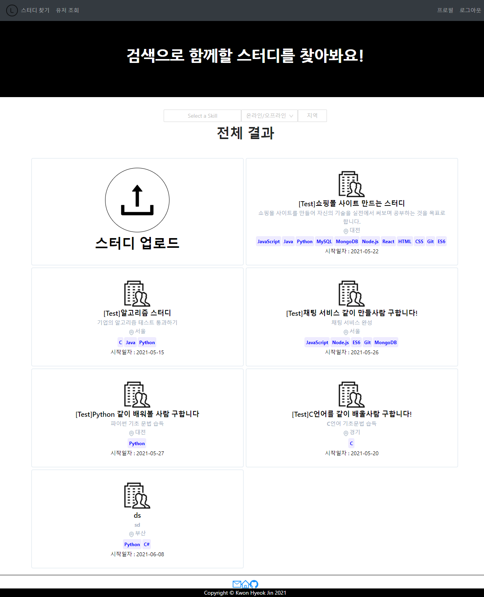
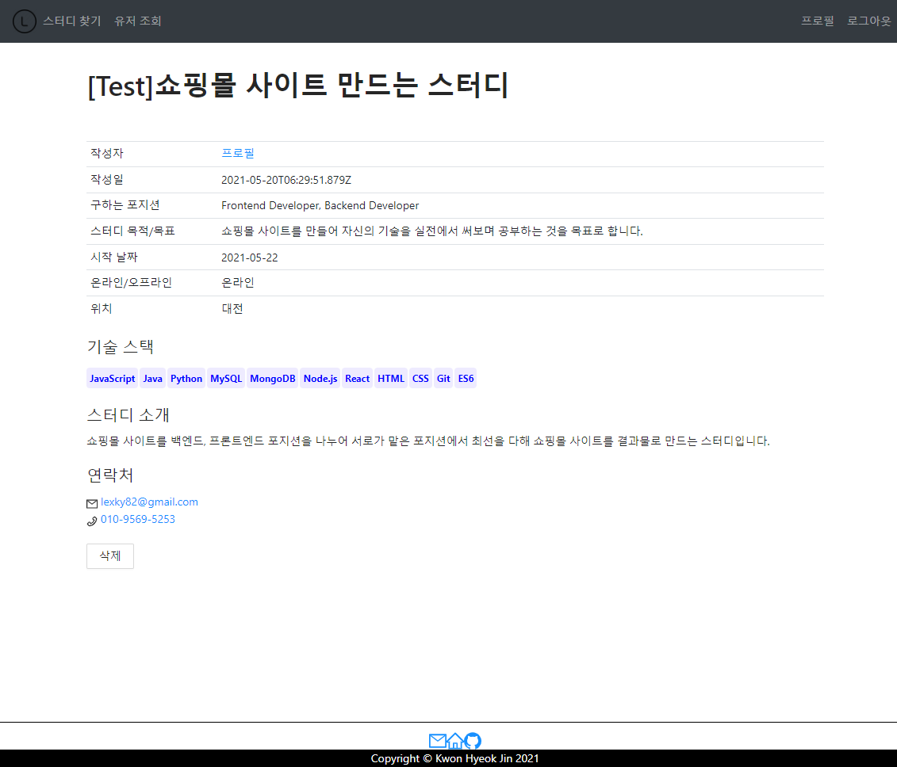
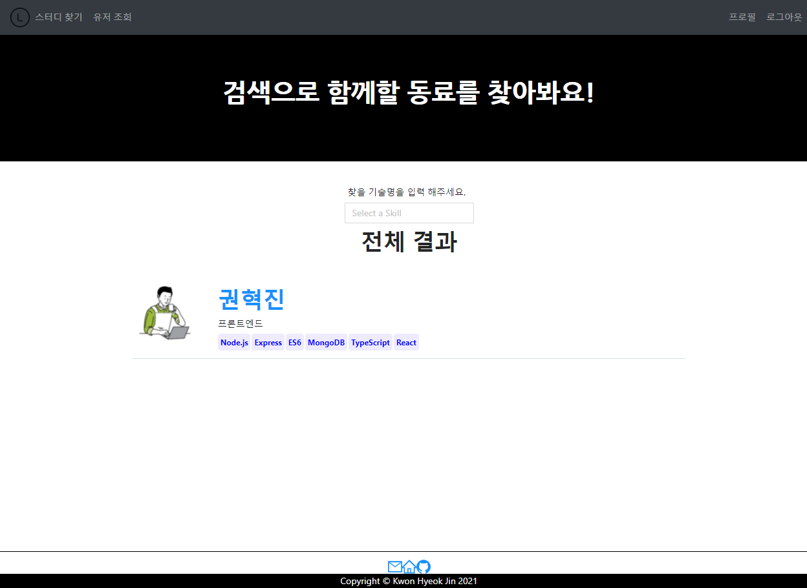
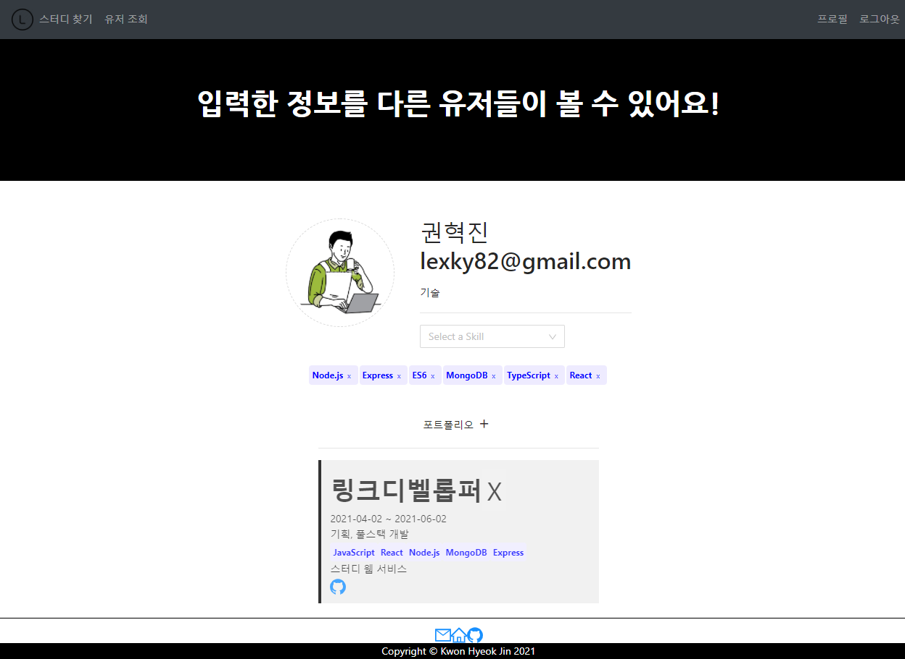

# link-developer

✔[사이트 링크](http://linkdeveloper.net)

**link-developer 프로젝트의 Repository 입니다.**

## 프로젝트 개요

- 프로젝트 명 : link-developer
- 개발 인원 : 1명
  - FullStack : **권혁진**
- 개발 기간 : 2021.04.03 ~ 2021.06.02
- 개발 언어 : JavaScript
- 개발 라이브러리
  - Frontend : React, Redux, Redux-Promise-Middleware, Axios, Ant Design
  - Backend : Express, Mongoose, Multer, Jwt, bcrypt, AWS EC2
  - Database : MongoDB
- 형상 관리 툴 : Git
- 간단 소개 : 스터디를 모집 하거나 필요로 하는 스킬을 사용하는 유저를 찾아 제안할 수 있는 개발자 특화 스터디 웹 서비스
- 기획 목적과 취지 : 개발 공부를 하는 와중에 스터디를 모집해서 자신이 배운 것을 공유(발표)하며 배우면 좀 더 효율적이게 배울 수 있다고 판단하였지만,
마땅한 개발자 스터디 관련 모집 웹 사이트를 찾을 수 없었고 개발자 스터디 웹 서비스를 개발 해보자는 생각으로 기획하게 되었다.

## 프로젝트 특징

- link-developer

  - 사용자가 선호하는 스터디를 필터를 통해 제공하는 서비스
  - 자신의 프로필을 작성하여 다른 유저가 조회할 수 있는 서비스

- 프로젝트에서 중추적인 데이터(유저 정보, 스터디 정보)를 리덕스를 사용하여 상태관리 함

- 반응형 디자인

  - 모바일 모드: 주요 모델 지원 UI
  - 데스크탑 모드: 데스크탑 환경에서 한눈에 볼 수 있는 UI

## 프로젝트 기능

- 회원가입/로그인 기능 및 쿠키 생성

- 스터디 게시/삭제

- 스터디 상세 페이지

- 사용자가 원하는 스터디를 찾기위해 (Skill, 온/오프라인, 지역)을 필터를 통해 세부적으로 검색이 가능

- 프로필에 사용할 수 있는 스킬과 경험했던 프로젝트를 프로필에 등록하여 다른 사람이 볼 수 있도록 할 수 있음

- 프로필 이미지를 등록할 수 있음

- link-developer에 가입한 다른 유저들의 프로필을 조회할 수 있음

- 임의의 스킬(JavaScript, Java 등)들을 검색하여 해당 스킬을 사용하는 유저들을 찾을 수 있음

## ScreenShot

- 메인페이지

- 스터디 찾기

- 스터디 상세페이지

- 유저 찾기

- 프로필

